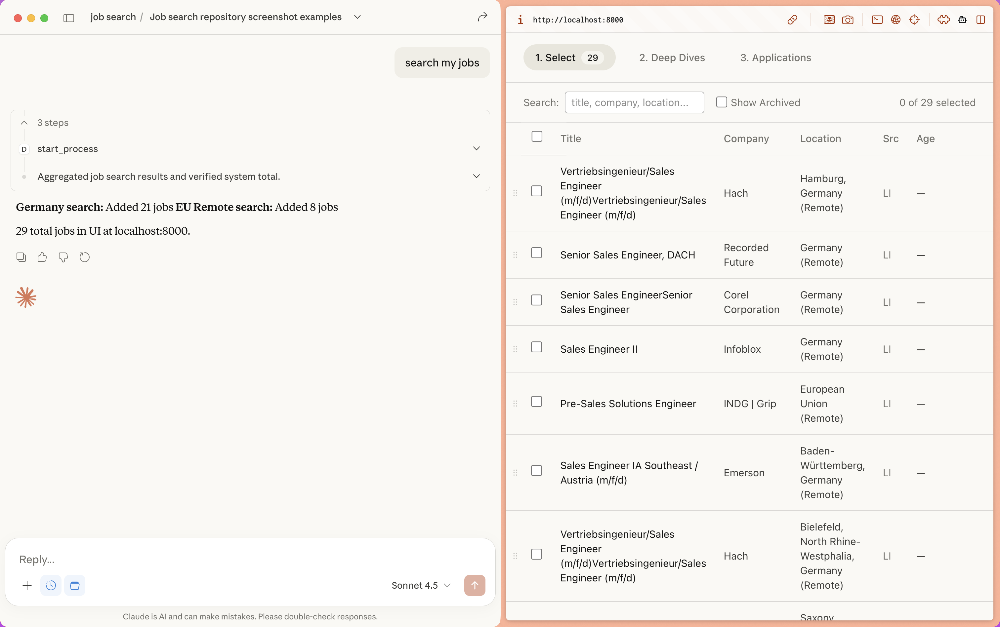

# Job Search Assistant

Job searching is exhausting. You scroll through hundreds of listings, most irrelevant. You research companies manually. You lose track of what you've applied to.

This skill turns Claude into your job search partner. Tell Claude about your background and what you're looking for—it builds a profile of your experience, preferences, and red flags. Then it searches across multiple job boards, filters out the noise, researches companies, and surfaces only the opportunities worth your time.

A companion web UI shows Claude's selections and research. You review, Claude refines. When you're ready to apply, Claude helps with gap analysis, CV tailoring, and interview prep.



> **Note:** This skill works best with **Claude Opus 4.5**, which has the strongest understanding of how to apply skills effectively.

## Requirements

- macOS
- [Claude Desktop](https://claude.ai/download)

The setup script auto-installs everything else (Homebrew, Python, Node.js, Poetry).

## Install

1. [Download ZIP](https://github.com/marcothedeveloper123/job_search/archive/refs/heads/main.zip) and unzip it
2. Open Terminal, type `cd ` (with a space), drag the folder into the window, press Enter
3. Run: `./scripts/setup.sh`

Then quit Terminal and restart Claude Desktop.

## Usage

Tell Claude: "search for jobs"

Claude will start the server and guide you through setup on first use. Review results at http://localhost:8000.

## Adding Job Boards

Scraper configuration is fully CLI-driven. Claude can add new job boards or fix broken ones without editing files.

```bash
jbs scraper list              # List existing scrapers
jbs scraper show <name>       # View config
jbs scraper create <name>     # Create new scraper
jbs scraper set <n> <k> <v>   # Set config value
jbs scraper test <n> <query>  # Test scraper
```

### Adding a New Board

Ask Claude: "Add support for nl.indeed.com"

Claude will:
1. Inspect the site's DOM structure (via Playwright MCP)
2. Create and configure the scraper:
   ```bash
   jbs scraper create indeed_nl
   jbs scraper set indeed_nl base_url "https://nl.indeed.com/jobs"
   jbs scraper set indeed_nl selectors.card ".job_seen_beacon"
   jbs scraper set indeed_nl selectors.title "h2.jobTitle a"
   ```
3. Test it: `jbs scraper test indeed_nl "product manager"`

### Fixing Broken Scrapers

When a job board redesigns and scraping fails:

1. Ask Claude: "LinkedIn search is returning empty results. Can you fix it?"
2. Claude inspects the updated DOM and fixes selectors:
   ```bash
   jbs scraper set linkedin selectors.card ".NEW_SELECTOR"
   jbs scraper test linkedin "product manager"
   ```

## License

MIT
